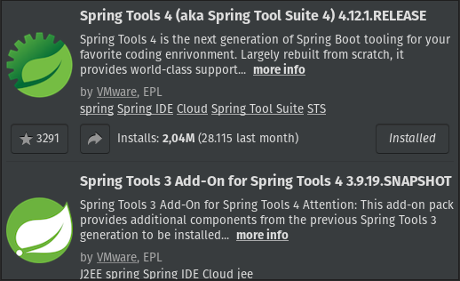

<h1 align="center">SGMEI</h1>

<h2>Descrição do Projeto</h2>

Projeto Integrador do IFES; se trata de um sistema genérico para gerenciamento de pequenos negócios

 

<h2>Configuração de ambiente (backEnd)</h2>
<ul>
  <li>Fazer o download da IDE Eclipse</li>
  <li>Instalar as seguintes extenções</li>
</ul>

  

<h2>Configuração de ambiente (frontEnd)</h2>

<h4 align="center"> 
  🚧  SGMEI 🚀 Em construção...  🚧
</h4>
